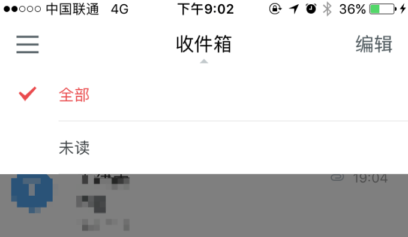
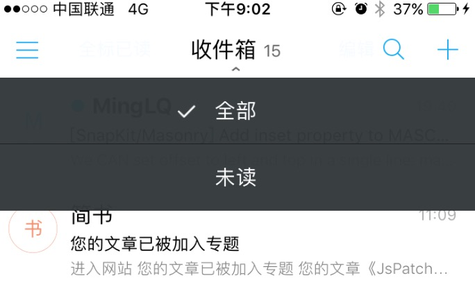
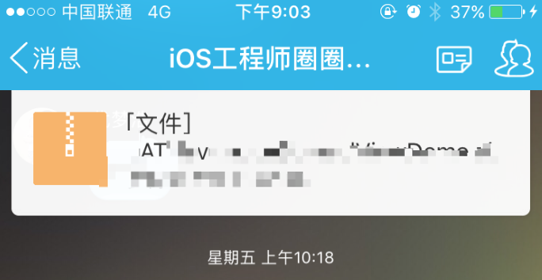
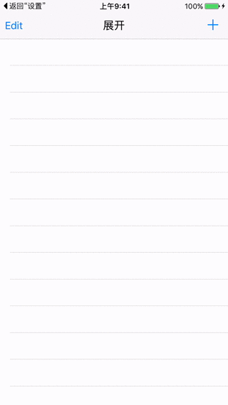

# 关于视图下拉菜单的猜想

日常使用App过程中经常看到下拉菜单的使用。例如：

阿里邮箱客户端顶部：



网易邮箱大师客户端顶部：



企鹅群：



对此做了以下实现方案的思考。

1、给navigationBar添加一个可以展开的视图。

2、给viewController添加一个可以下拉展开的视图。

#### 1、给navigationBar添加一个可以展开的视图。

git：https://github.com/KKLater/UINavigationBar-LATNavigationSpreadViewCategory

##### 1.1演示


##### 1.2使用

```objective-c
//直接设置navigationBar的spreadView属性，来设置展开视图
self.navigationController.navigationBar.spreadView = self.navigationSpreadView;
```

```objective-c
//可以用过navigationBar的isSpreadViewShow属性判定视图是否处于展开的状态
if (self.navigationController.navigationBar.isSpreadViewShow) {
	//隐藏视图
    [self.navigationController.navigationBar hideSpreadView];
} else {
	//展开视图
    [self.navigationController.navigationBar showSpreadView];
}
```

#### 2、给viewController添加一个可以下拉展开的视图。

##### 2.1演示

2.1.1 普通用法

​	

2.2.2 自定义背景视图、

##### 2.2使用

###### 2.2.1显示

直接调用显示方法

```objective-c
/**
 *  spreadView显示
 *
 *  @param animation 显示过程block
 *  @param completed 显示结束block
 */
- (void)showSpreadViewAnimation:(void(^)())animation completed:(void(^)())completed;
```

可以通过设置animation来执行显示过程中的动画，设置completed来设置显示结束的动画。例如：

```objective-c
  __weak typeof(self)weakSelf = self;
 [self showSpreadViewAnimation:^{
     weakSelf.titleButton.selected = !weakSelf.isSpreadViewShow;
 } completed:^{
     NSLog(@"isShow");
 }];
```

###### 2.2.2 隐藏

直接调用隐藏方法

```objective-c
/**
 *  spreadView隐藏
 *
 *  @param animation 隐藏过程block
 *  @param completed 隐藏结束block
 */
- (void)hideSpreadViewAnimation:(void(^)())animation completed:(void(^)())completed;
```

可以通过设置animation来执行消失过程中的动画，设置completed来设置视图隐藏结束的动画。例如：

```objective-c
__weak typeof(self)weakSelf = self;
[self hideSpreadViewAnimation:^{
     weakSelf.titleButton.selected = !weakSelf.isSpreadViewShow;
} completed:^{
     NSLog(@"isHide");
}];
```


***注意***：过程中的animation和结束的completed与category内的代码是相互独立的。

###### 2.2.3 获取当前状态（显示或者隐藏）

通过

```objective-c
/**
 *  视图是否处于展开的状态
 */
@property (assign, nonatomic, readonly) BOOL isSpreadViewShow;
```

属性可以获取当前展示状态。

###### 2.2.4 设置spreadView

直接设置属性`@property (strong, nonatomic) UIView *spreadView;`来设置spreadView。在设置属性前，需要将spreadView的各种属性设置完成。例如frame。

```objective-c
self.navigationSpreadView.frame = CGRectMake(0, 64, CGRectGetWidth(self.view.frame), 100);
self.spreadView = self.navigationSpreadView;
```

###### 2.2.5 自定义backView

已经默认封装的backView是一个黑色，alpha为0.3的视图。未添加点击消失的手势。

不单独设置backView，可使用已经封装的backView，不需要做任何处理。

如果需要设置特殊的backView，可以设置`@property (strong, nonatomic) UIView *spreadBackView;`属性来设置。同样也可以给spreadBackView添加手势。例如：

```objective-c
//自定义背景图
UIView *back =  [[UIView alloc] initWithFrame:self.view.bounds];
back.backgroundColor = [UIColor redColor];
self.spreadBackView = back;

//给背景视图添加手势
UITapGestureRecognizer *tapGesture = [[UITapGestureRecognizer alloc] initWithTarget:self action:@selector(tap)];
[self.spreadBackView addGestureRecognizer:tapGesture];
```

手势对应调用隐藏方法即可。

```objective-c
__weak typeof(self)weakSelf = self;
[self hideSpreadViewAnimation:^{
    weakSelf.titleButton.selected = !weakSelf.isSpreadViewShow;
} completed:^{
    NSLog(@"isShow");
}];
```

期望：暂时只是添加了spreadView功能。并未设置出现的方向。后期期望添加展开视图的出现方向。


